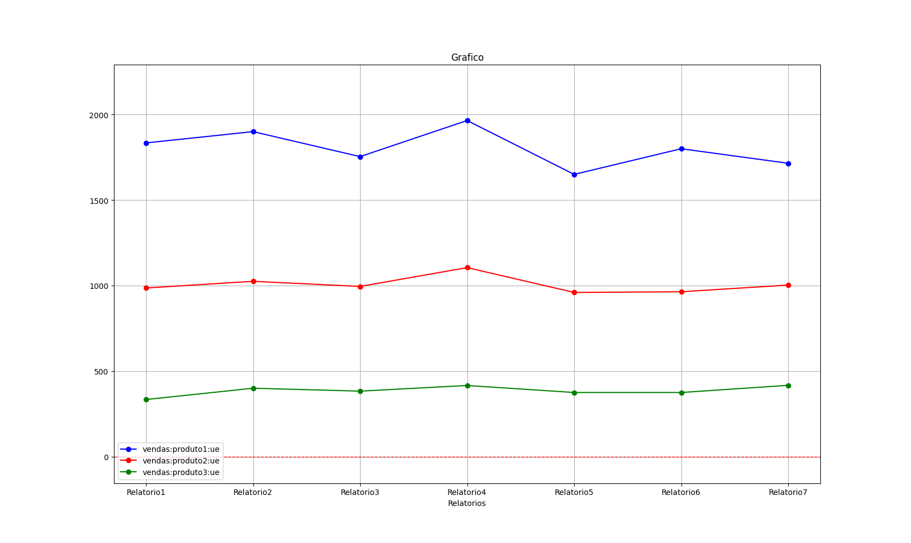
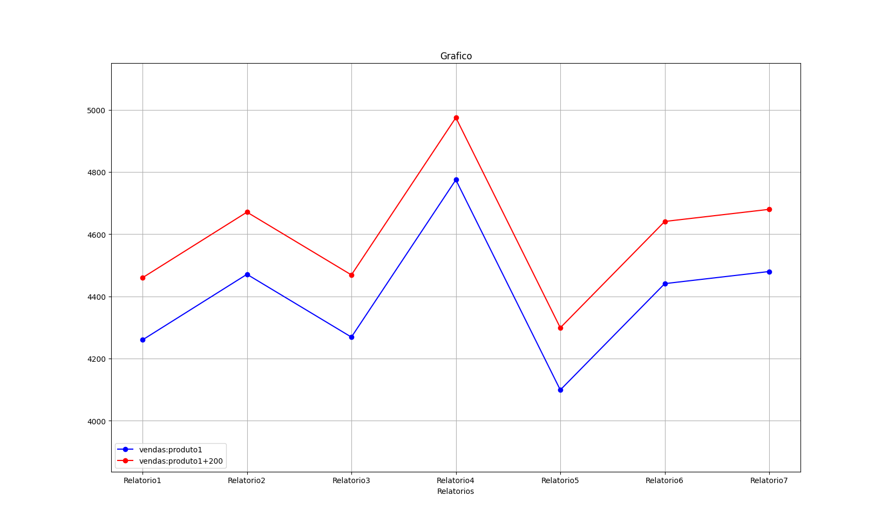
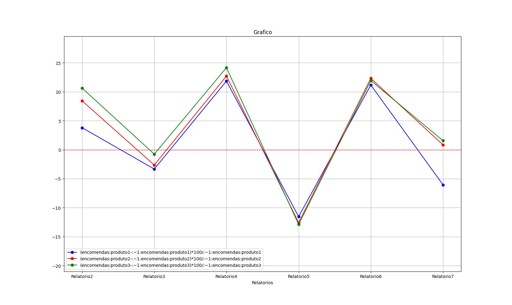

# AgileGraphs
Programa de análise de dados para o Jogo de Gestão IST Management Challenge.
Feito pela equipa AGILE team.



## Introdução
AgileGraphs oferece uma interface de terminal para criar gráficos e calcular valores
relativos aos relatórios de uma empresa do Jogo de Gestão IST Management Challenge.

Existem três modos:
- Cria Gráficos
- Calcula Valores
- Mostra Valores


## Instalação
A maneira mais fácil de instalar é correr o script de instalação com
o comando seguinte:
```bash
source ./install.sh
```
É preciso também colocar os relatórios da empresa no diretório `relatorios/`
(Os ficheiros devem ser do tipo '.xlsx' e ter o nome 'Relatorio1', 'Relatorio2', etc..).


## Como utilizar
Para utilizar o programa tem de ter o ambiente virtual inicializado, pode o inicializar com o seguinte comando:
```bash
source venv/bin/activate
```
(se correu o script de instalação já deve estar com o ambiente virtual inicializado)

Correr o código:
```bash
python3 agile_graphs.py
```
Irá aparecer o seguinte menu:
```
------ AgileGraphs ------

Escolha uma opção:
[1] - Cria gráficos
[2] - Calcula valores
[3] - Mostra valores
[q] - Sair

>
```
Em qualquer modo pode pressionar 'q' para sair do programa ou retroceder ao menu inicial.


## Expressões:

Exemplo de expressões válidas:
```
vendas:produto1
vendas:produto1:ue
vendas:ue
vendas
quotasMercado:empresa7:nafta
demonstracaoResultados:lucro
(vendas:produto2 - encomendas:produto2) + 100 - 100 / 1
(produzidos:produto1 - vendas:produto1) / produzidos:produto1
```
Exemplo de expressões inválidas:
```
vendas:aaaaaaa:ue
vendas:ue:produto1 
owadpaaÇWIAJdçawjd ola
```
Uma expressão é uma string que comtém os operadores '+', '-', '*', '/', '(' e ')', espaços, variaveis e valores numéricos (inteiros ou floats).
Quando uma expressão é avaliada todas as variaveis são substituidas pelo seu valor numérico correspondente e é calculado o resultado da expressão (que agora só contêm números e operadores) de acordo com as regras normais de aritmética.

As variaveis são substituidas pelos valores correspondentes a um dado relatório.


### Variáveis

Uma variavel é qualquer string que não contem espaços ou operadores e não é um número.
Uma variavel é uma forma de especificar mais facilmente células especificas dos relatórios.

A syntax básica de uma variavel é:
```
    <chave1> ou <chave1>:<chave2> ou <chave1>: ... :<chave2>.
```
Ou seja, strings separadas por ':'.

Se uma expressão conter variaveis inválidas esta será totalmente ignorada.
```
> kajçslkdjçlaskjdf
Expressao inválida - 'kajçslkdjçlaskjdf' está mal escrito.
>
```

Alguns exemplos de variáveis são:
```
entregas:produto1:ue                       |  O número de entregas do produto 1 na união europeia
quotasMercado:empresa7:prod1:nafta         |  As quotas de mercado da empresa7 no produto 1 na nafta
recursosHumanos:disponivel:especializados  |  O número de operários especializados disponíveis
```

No caso da variaveis 'entregas:produto1:ue', as suas chaves são 'entregas', 'produto1' e 'ue'.

É importante notar que nenhuma variável usa assentos ou 'ç'.

Para ver as variáveis válidas pode ver o ficheiro `dados_celulas.py`, este contem um dicionário.
```
# dados_celulas.py
dados_relatorio = {
    "pedidos": {
        "produto1": "1AA12",
        "produto2": "1AC12",
        "produto3": "1AE12",
    },

...

    "transportes": {
        "distanciaViagem": {
            "ue": "1AA51",
            "nafta": "1AC51",
            "internet": "1AE51",
        },
...
```
Como podemos ver as seguintes variáveis são válidas:
```
pedidos:produto1
pedidos:produto2
pedidos:produto3
transportes:distanciaViagem:ue
transportes:distanciaViagem:nafta
transportes:distanciaViagem:internet
```


### Aliases

É possível escrever de forma resumida algumas chaves de uma variável usando aliases.
Os aliases disponíveis estão defenidos no dicionáro `ALIASES` que está presente no ficheiro `calcula_info.py`.
Alguns exemplos:
```
dr:compraMateriaPrima  ->  demonstracaoResultados:compraMateriaPrima
qm:emp7:prod1:ue       ->  quotasMercado:empresa7:produto1:ue
```


A expanção dos aliases é feita antes das expressões serem avaliadas.
No resto da documentação aliases são usados por motivos de praticalidade, o programa em si nunca os utiliza internamente.


### Omição de chaves da variavel

Imagine que quer saber a soma das vendas do produto1 em todos os mercado.
Escrever `vendas:prod1 + vendas:prod1:nafta + vendas:prod1:internet` dá muito trabalho.
É por isso que é possível simplesmente escrever `vendas:prod1`.

Quando o valor desta variavel for calculado será feita a soma de todas as suas expanssões.

Alguns exemplos:
```
entregas:prod2 = entregas:prod2:ue + entregas:prod2:nafta + entregas:prod2:internet
qm:emp7 = qm:emp7:prod1:ue + qm:emp7:prod1:nafta + qm:emp7:prod1:internet
        + qm:emp7:prod2:ue + qm:emp7:prod2:nafta + qm:emp7:prod2:internet
        + qm:emp7:prod3:ue + qm:emp7:prod3:nafta + qm:emp7:prod3:internet
```

Também é possível omitir chaves do meio da variável.
```
vendas:ue = vendas:prod1:ue + vendas:prod2:ue + vendas:prod3:ue
qm:ue = qm:emp1:prod1:ue + qm:emp1:prod2:ue + qm:emp1:prod3:ue
      + qm:emp2:prod1:ue + qm:emp2:prod2:ue + qm:emp2:prod3:ue
        ...
      + qm:emp7:prod1:ue + qm:emp7:prod2:ue + qm:emp7:prod3:ue
```


### Prefixo de relatório

Imagine que quer saber a variação de uma quantidade ao longo dos relatórios (trimestres)
Para tal precisa de aceder ao trimestre anterior ao atual (o que está a ser considerado quando a expressão é avalizada).
Pode usar um prefixo de relatório na variável, estes seguem a seguinte syntax:
```
    :<símbolo><numero inteiro>:<variável>
```

#### Aceder a relatórios posteriores

Para aceder a um relatório posterior o prefixo será somemte um número inteiro (o símbolo será vazio).

Exemplos:
```
:1:vendas:prod1:ue    |  O valor das vendas do produto 1 no mercado da ue no próximo relatório.
:2:vendas:prod1:ue    |  O valor das vendas do produto 1 no mercado da ue no próximo próximo relatório.
:0:vendas:prod1:ue    |  O valor das vendas do produto 1 no mercado da ue no relatório atual.
:999:vendas:prod1:ue  |  Dá erro, a não ser que tenhas mil relatórios.
```

#### Aceder a relatórios anteriores

Para aceder a um relatório anterior o símbolo será '\~' (não se pode usar o '-' sendo que é um operador).

Exemplos:
```
:\~1:vendas:prod1:ue  |  O valor das vendas do produto 1 no mercado da ue relatório anterior.
:\~0:vendas:prod1:ue  |  O valor das vendas do produto 1 no mercado da ue no relatório atual.
```

Funciona da mesma forma que aceder a relatórios posteriores, mas ao contrário.

#### Aceder a um relatório especifico

Se quiser o valor de uma variável num relatório especifico o símolo será '#'.

Exemplos:
```
:1:vendas:prod1:ue     |  O valor das vendas do produto 1 no mercado da ue no primeiro relatório
:1000:vendas:prod1:ue  |  Dá erro, a não ser que tenhas mil relatórios
```


### Expanção ALL

Imagine que quer fazer o gráfico de vendas de todos os produtos no merado da nafta, escrever:
```
> vendas:prod1:nafta
> vendas:prod2:nafta
> vendas:prod3:nafta
```
Dá trabalho, então pode só usar `vendas:ALL:nafta`.
Esta expanção é feita antes das expressões seram avaliadas.
Alguns exemplos:
```
entregas:ALL            ->  entregas:prod1,  entregas:prod2,   entregas:prod3
entregas:ALL:ALL        ->  entregas:prod1:ue,  entregas:prod1:nafta,  entregas:prod1:internet,
                            entregas:prod2:ue,  entregas:prod2:nafta,  entregas:prod2:internet,
                            entregas:prod3:ue,  entregas:prod3:nafta,  entregas:prod3:internet
qm:ALL:prod1:ue         ->  qm:emp1:prod1:ue, qm:emp2:prod1:ue, ... , qm:emp7:prod1:ue
vendas:ALL + vendas:ALL ->  vendas:prod1 + vendas:prod1, vendas:prod1 + vendas:prod2, vendas:prod1 + vendas:prod3,
                            vendas:prod2 + vendas:prod1, vendas:prod2 + vendas:prod2, vendas:prod2 + vendas:prod3,
                            vendas:prod3 + vendas:prod1, vendas:prod3 + vendas:prod2, vendas:prod3 + vendas:prod3,
website:ALL:prod1       ->  dá erro, embora website:reclamacoes:prod1 exista, website:visitas:prod1 não.
```
 

### Expanssão ALLn

Imagine que quer saber a variação das vendas de todos os produtos (individualmente) ao longo dos relatórios (trimestres) em percentagem.
Terias de repetir três vezes a expressão `(vendas:prod1 - :\~1:vendas:prod1) * 100 / :\~1:vendas:prod1`, pode usar 
`(vendas:ALL1 - :\~1:vendas:ALL1) * 100 / :\~1:vendas:ALL1`.

Seria igual usar ALL2 ou ALLasçdljf, qualquer string começada por ALL que não contenha operadores, espaços e ':' funcionaria.
É possível ter ALL1, ALL2 ...  na mesma expressão, cada um é expandido independentemente.

Alguns exemplo:
```
vendas:ALL1 + entregas:ALL1  ->  vendas:prod1 + vendas:prod1, vendas:prod2 + vendas:prod2, vendas:prod3 + vendas:prod3.
vendas:ALL1 + vendas:ALL2    ->  vendas:prod1 + vendas:prod1, vendas:prod1 + vendas:prod2, vendas:prod1 + vendas:prod3, 
                                 vendas:prod2 + vendas:prod1, vendas:prod1 + vendas:prod2, vendas:prod2 + vendas:prod3, 
                                 vendas:prod3 + vendas:prod1, vendas:prod3 + vendas:prod2, vendas:prod3 + vendas:prod3, 
vendas:ALL1 + vendas:ALL     ->  vendas:prod1 + vendas:prod1, vendas:prod1 + vendas:prod2, vendas:prod1 + vendas:prod3, 
                                 vendas:prod2 + vendas:prod1, vendas:prod2 + vendas:prod2, vendas:prod2 + vendas:prod3, 
                                 vendas:prod3 + vendas:prod1, vendas:prod3 + vendas:prod2, vendas:prod3 + vendas:prod3, 
entregas:ALL1:ALL            ->  entregas:prod1:ue,  entregas:prod1:nafta,  entregas:prod1:internet,
                                 entregas:prod2:ue,  entregas:prod2:nafta,  entregas:prod2:internet,
                                 entregas:prod3:ue,  entregas:prod3:nafta,  entregas:prod3:internet
vendas:ALL1 * website:ALL1   ->  dá erro, website:prod1 não existe.
```


### Aceder diretamente a células

Podes aceder ao valor de um célula de uma folha de exel especifica usando a seguinte syntax:
```
    <folha><coluna><linha>:
```

Exemplos:
```
1AA12:    |  A célula AA12 da 1º folha do relatório.
2U12:     |  A célula U12 da 2º folha do relatório.
:1:1A23:  |  A célula A23 da 1º folha do primeiro relatório.
```

Se uma célula estiver em branco o seu valor é 0.


## Cria gráficos

Este modo aceita várias expressoes, quando tentar voltar para o menu original ele irá mostrar um gráfico com os valores das expressões introduzidas para cada relatório para o qual as expressões sejam validas. Caso nenhuma expressão seja introduzida irá imediatamente voltar para o menu inicial.

### Exemplo 1
```
Insira expressões para gráficos (q para parar):
> vendas:prod1
> vendas:prod1 + 200
>
```

### Exemplo 2
```
Insira expressões para gráficos (q para parar):
> entregas
> :~1:entregas
> :1:entregas
>
```

### Exemplo 3
```
Insira expressões para gráficos (q para parar):
> vendas:ALL:ue
>
```

### Exemplo 4
```
Insira expressões para gráficos (q para parar):
> (encomendas:ALL1 - :~1:encomendas:ALL1) * 100  / :~1:encomendas:ALL1
>
```

### Exemplo 5
```
Insira expressões para gráficos (q para parar):
> qm:emp7:prod3:ue
> 2W38: + 5
>
```


## Calcula valores

Este modo escreve o valor numerico da expressão dada em relação ao ultimo relatório para o qual a expressão é válida.
```
Insira expressão para calcular (q para sair):
> vendas:prod1:ue * 2 - 100 + 0.2
3330.2

> vendas:ALL:ue
vendas:prod1:ue = 1715
vendas:prod2:ue = 1003
vendas:prod3:ue = 417

>
```

## Mostra valores

Este modo ainda está a ser desenvolvido, atualmente não faz nada.


## DEV

Esta secção destina-se a potenciais colaboradores ;)


### Conceitos

#### expressao_raw

Uma string que representa uma expressão introduzida pelo utilizador.

`vendas:prod1 - :~1:entregas:prod2`

#### expressao

Lista de strings, onde cada string é um operador ou uma variável.
Todos os aliases já foram substituidos.
Todos os ALL e ALLn já forma substituidos

`['vendas:produto1', '-', ':~1:entregas:produto2']`

#### variavel

Uma string que representa uma variável isolada.

`vendas:produto1` ou `:~1:entregas:produto2`

#### chaves

Uma lista de strings, onde cada string é uma chave da variável.

`['vendas', 'produto1']` ou `['', '~1', 'entregas', 'produto2']`.

Na maioria do programa as chaves '' e '~1' são removidas, então seria só `['entregas', 'produto2']`.

#### relatorio

É um número inteiro que indica o número do relatório para o qual a expressão vai ser calculada.
Começam em 0.


### Nomes

Usa Pascal case. Por exemplo, calculaInfoExpressao.
Nada de assentos ou 'ç'.


## Feito
- renomear relatórios para números 
- multiplas linhas no mesmo gráfico
- implementar segunda folha
- adicionar aliases às expressoes
- interface CLI
- expanção ALL
- acesso direto a celúlas
    1AA32:
    2U12:
- aceder a valores de outros trimestres
    :~2:vendas:prod1
    :+2:vendas:prod1
    :2:vendas:prod1
- escrever os erros
- fix bugs with ALL
- introduzir numbered ALLs, 1ALL, 2ALL
- historico
- autocomplete
- documentação
- integrar o resto dos dados
- trocar prodX por produtoX e criar aliases
- bugs with autocomplete
- bug with aliases and autocomplete


## TODO
- atualizar cli.py, prompt de input devia ser alterada
- remove title parameter from criaGraficos
- por o mostraValores a funcionar
- seleção de cores para os graficos ?
